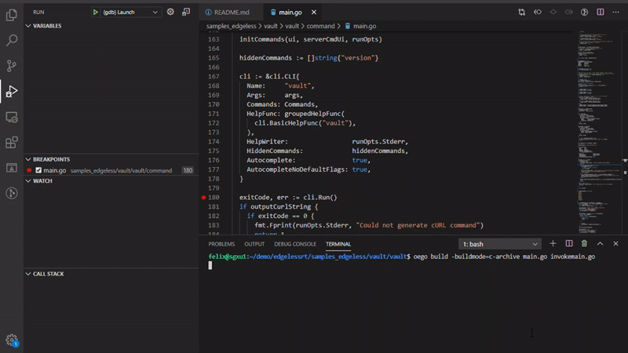

# Edgeless RT


[Edgeless RT](https://edgeless.systems) is an SDK for Trusted Execution Environments (TEE) built on top of [Open Enclave](https://github.com/openenclave/openenclave). It adds support for modern programming languages (in particular Go) and facilitates the porting of existing applications.
Currently, hardware-wise, Edgeless RT focuses on [Intel SGX](https://software.intel.com/en-us/sgx). Support for other TEEs will follow as it becomes available in Open Enclave.

Key features of Edgeless RT are:
* Comprehensive support for Go, most existing code runs without changes
* Extended C/C++ support
  * More libc and POSIX functions
  * More C++17 STL
  * pthread and std::thread
  * libstdc++ for better compatibility with existing code
* Seamless integration with [Marblerun](https://github.com/edgelesssys/marblerun) to create distributed confidential applications
* Experimental support for Rust
* Soon: support for Python

## Quick Start
If you are on Ubuntu 18.04 and do not want to build the SDK yourself, you can install the binary release:
```bash
wget -qO- https://download.01.org/intel-sgx/sgx_repo/ubuntu/intel-sgx-deb.key | sudo apt-key add
sudo add-apt-repository 'deb [arch=amd64] https://download.01.org/intel-sgx/sgx_repo/ubuntu bionic main'
wget https://github.com/edgelesssys/edgelessrt/releases/download/v0.1.2/edgelessrt_0.1.2_amd64.deb
sudo apt install ./edgelessrt_0.1.2_amd64.deb
```
Then proceed with [Use](#use).

## Build
Edgeless RT primarily targets Ubuntu 18.04. Other Linuxes may work as well. Windows is not yet supported.

1. Determine the SGX support of your system
   ```bash
   cc -ooesgx tools/oesgx/oesgx.c && ./oesgx
   ```
   You will get one of the following three types of output:

   |                                oesgx output | SGX support level |
   |:--------------------------------------------|:------------------:|
   | CPU supports SGX_FLC:Flexible Launch Control<br>CPU supports Software Guard Extensions:SGX1| SGX1+FLC          |
   | CPU supports Software Guard Extensions:SGX1 | SGX1              |
   | CPU does not support SGX                    |   Simulation      |

2. Set up the environment

   Ansible is required to install the project requirements. Install it by running:
   ```bash
   sudo scripts/ansible/install-ansible.sh
   ```

   Run one of the following commands depending on the SGX support level:

   * SGX1+FLC in an Azure Confidential Compute (ACC) VM:
     ```bash
     ansible-playbook scripts/ansible/oe-contributors-acc-setup.yml
     ```

   * SGX1+FLC:
     ```bash
     ansible-playbook scripts/ansible/oe-contributors-setup.yml
     ```

   * SGX1:
     ```bash
     ansible-playbook scripts/ansible/oe-contributors-setup-sgx1.yml
     ```

   * Simulation:
     ```bash
     ansible-playbook scripts/ansible/oe-contributors-setup-sim.yml
     ```

   NOTE: The Ansible playbook commands require `sudo` rights. You may need to specify `--ask-become-pass` and enter your sudo password.

3. Build the SDK
   ```bash
   mkdir build
   cd build
   cmake -GNinja ..
   ninja
   ```
   To set a custom installation path (default: `/opt/edgelessrt`), add, e.g., `-DCMAKE_INSTALL_PREFIX=~/edgelessrt-install`.

## Test
After building, run the following command in the build directory to confirm everything works as expected:

```bash
ctest
```

In simulation mode run this command instead:
```bash
OE_SIMULATION=1 ctest
```

## Install
From the build directory run:
```bash
ninja install
```
Or if you do not have write permissions for the installation path:
```bash
sudo ninja install
```

## Use
To use the SDK you need to source the `openenclaverc` file to setup environment variables:
```bash
. /opt/edgelessrt/share/openenclave/openenclaverc
```

Now you are ready to build applications with Edgeless RT! To start, check out the [samples](samples_edgeless/README.md) in the `samples_edgeless` folder.

Also see the [C API documentation](https://edgelesssys.github.io/edgelessrt) and/or the [Go API documentation](https://pkg.go.dev/github.com/edgelesssys/ertgolib).

## Debug


You can use Open Enclave's `oegdb` to debug enclave code built with Edgeless RT. `oegdb` is automatically installed with Edgeless RT. It also supports Go enclaves.

`oegdb` works great with Visual Studio Code (vscode). For example, use the following configuration to debug the in-enclave Go code from our [HashiCorp Vault sample](samples_edgeless/vault/README.md) in vscode:

```json
{
  "version": "0.2.0",
  "configurations": [
    {
      "name": "(oegdb) Launch",
      "miDebuggerPath": "/opt/edgelessrt/bin/oegdb",
      "type": "cppdbg",
      "request": "launch",
      "program": "/opt/edgelessrt/bin/erthost",
      "args": ["enclave.signed","server","-dev"],
      "stopAtEntry": false,
      "cwd": "${workspaceFolder}/samples_edgeless/vault/build/",
      "environment": [],
      "externalConsole": false,
      "MIMode": "gdb",
      "setupCommands": [
          {
              "description": "Enable pretty-printing for gdb",
              "text": "-enable-pretty-printing",
              "ignoreFailures": true
          },
          {
              "text": "handle SIGILL nostop"
          }
      ]
    }
  ]
}
```
